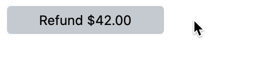

# react-confirmation-button

> An exploration in desktop UI buttons for irreversible actions

### What & Why?

Confirmation Buttons are used for actions that are either irreversible (example:
deleting from a datastore) or hard to undo (example: payments). They are buttons
that can minimize human errors when interacting with UIs that use such actions.

### Alternatives

Confirmation Buttons should only be used for specific use cases. Before adding
them to your UI, consider other alternatives:

1. If an action can be reversed, consider offering an undo functionality
   instead. This will reduce the friction and anxiety that comes with using the
   UI and in-turn offer a better experience.

2. If an action is rarely invoked, consider offering a confirmation dialog with
   a verb button that states the action and its magnitude (example: "Delete 10
   Items"). You may additionally add a textbox to make the user acknowledge the
   affected entity by typing its name (examples: GitHub's delete repository UI
   and AWS S3 delete bucket UI).

### When to use Confirmation Buttons

Reserve the use of Confirmation Buttons for use cases where:

1. Performing an irreversible action is part of the regular flow
2. Such action may need to be repeated many times in the same session

### Technical Approach

- `xstate` for behaviour
- `styled-components` for visual style
- `framer-motion` for animations and interactivity
